# Bayesian Neural Networks
[](https://github.com/JavierAntoran/Bayesian-Neural-Networks/blob/master/LICENSE) [](https://www.python.org/downloads/release/python-2716/)
[](https://pytorch.org/)


Pytorch implementations for the following approximate inference methods:

* [Bayes by Backprop](#bayes-by-backprop-bbp)
* [Bayes by Backprop + Local Reparametrisation Trick](#local-reparametrisation-trick)
* [MC dropout](#mc-dropout)
* [Stochastic Gradient Langevin Dynamics](#stochastic-gradient-langevin-dynamics-sgld)
* [Preconditioned SGLD](#psgld)
* [Kronecker-Factorised Laplace Approximation](#kronecker-factorised-laplace)
* [Stochastic Gradient Hamiltonian Monte Carlo with Scale Adaption](#stochastic-gradient-hamiltonian-monte-carlo)

We also provide code for:
* [Bootstrap MAP Ensemble](#bootstrap-map-ensemble)

### Prerequisites
* PyTorch
* Numpy
* Matplotlib

The project is written in python 2.7 and Pytorch 1.0.1. If CUDA is available, it will be
used automatically. The models can also run on CPU as they are not excessively big.

## Usage

### Structure

#### Regression experiments


We carried out homoscedastic and heteroscedastic regression
  experiements on toy datasets, generated with [(Gaussian Process ground truth)](https://colab.research.google.com/drive/1t-OmK57w31ukbuftqk-1zAFzIgZhSMwG),
    as well as on real data (six [UCI datasets](https://archive.ics.uci.edu/ml/datasets.php)). 
    
    
*Notebooks/classification/(ModelName)_(ExperimentType).ipynb*: Contains experiments using (ModelName)
 on (ExperimentType), i.e. homoscedastic/heteroscedastic. The heteroscedastic
  notebooks contain both toy and UCI dataset experiments for a given (ModelName).

We also provide [Google Colab](https://colab.research.google.com/) notebooks. This means that
  you can run on a GPU (for free!). No modifications required - all dependencies 
  and datasets are added from within the notebooks - except for selecting 
  Runtime -> Change runtime type -> Hardware accelerator -> GPU.


<!--* [Regression Results](#homoscedastic-regression)-->

#### MNIST classification experiments

*train_(ModelName)_(Dataset).py*: Trains (ModelName) on (Dataset). Training
metrics and model weights will be saved to the specified directories.

*src/*: General utilities and model definitions.

*Notebooks/classification*: An asortment of notebooks which allow for model training, evaluation and
running of digit rotation uncertainty experiments. They also allow for weight
distribution plotting and weight pruning.  They allow for loading of pre-trained models
for experimentation.

### Bayes by Backprop (BBP)
(https://arxiv.org/abs/1505.05424)

Colab notebooks with regression models: [BBP homoscedastic](https://colab.research.google.com/drive/1K1I_UNRFwPt9l6RRkp8IYg1504PR9q4L) / [heteroscedastic](https://colab.research.google.com/drive/13oTnT6oKnB6NNBPVAczx8X-QEot2hfp9)

Train a model on MNIST:
```bash
python train_BayesByBackprop_MNIST.py [--model [MODEL]] [--prior_sig [PRIOR_SIG]] [--epochs [EPOCHS]] [--lr [LR]] [--n_samples [N_SAMPLES]] [--models_dir [MODELS_DIR]] [--results_dir [RESULTS_DIR]]
```
For an explanation of the script's arguments:
```bash
python train_BayesByBackprop_MNIST.py -h
```

Best results are obtained with a Laplace prior.

#### Local Reparametrisation Trick
(https://arxiv.org/abs/1506.02557)

Bayes By Backprop inference where the mean and variance of activations
 are calculated in closed form. Activations are sampled instead of
 weights. This makes the variance of the Monte Carlo ELBO estimator scale
 as 1/M, where M is the minibatch size. Sampling weights scales (M-1)/M.
 The KL divergence between gaussians can also be computed in closed form,
 further reducing variance. Computation of each epoch is faster and so is convergence.

Train a model on MNIST:
```bash
python train_BayesByBackprop_MNIST.py --model Local_Reparam [--prior_sig [PRIOR_SIG]] [--epochs [EPOCHS]] [--lr [LR]] [--n_samples [N_SAMPLES]] [--models_dir [MODELS_DIR]] [--results_dir [RESULTS_DIR]]
```

### MC Dropout
(https://arxiv.org/abs/1506.02142)

A fixed dropout rate of 0.5 is set.

Colab notebooks with regression models: [MC Dropout homoscedastic](https://colab.research.google.com/drive/11knF0-7F7hK3Yhsj8VkG9fHbdB-LvtpQ) [heteroscedastic](https://colab.research.google.com/drive/11wYjIF9_mPTpJJ-M-TqLJ1X6sfeXtrOd)

Train a model on MNIST:
```bash
python train_MCDropout_MNIST.py [--weight_decay [WEIGHT_DECAY]] [--epochs [EPOCHS]] [--lr [LR]] [--models_dir [MODELS_DIR]] [--results_dir [RESULTS_DIR]]
```
For an explanation of the script's arguments:
```bash
python train_MCDropout_MNIST.py -h
```


### Stochastic Gradient Langevin Dynamics (SGLD)
(https://www.ics.uci.edu/~welling/publications/papers/stoclangevin_v6.pdf)

In order to converge to the true posterior over w, the learning rate
should be annealed according to the [Robbins-Monro](https://en.wikipedia.org/wiki/Stochastic_approximation)
 conditions. In practise, we use a fixed learning rate.
 
Colab notebooks with regression models: [SGLD homoscedastic](https://colab.research.google.com/drive/1vV5bsp7o6SyhAXErHwUC1FYxb-9Dc9SK) / [heteroscedastic](https://colab.research.google.com/drive/1Qk-gGWLwVrYc6hn7-EKIbkIYeZoWBx4f)

Train a model on MNIST:
```bash
python train_SGLD_MNIST.py [--use_preconditioning [USE_PRECONDITIONING]] [--prior_sig [PRIOR_SIG]] [--epochs [EPOCHS]] [--lr [LR]] [--models_dir [MODELS_DIR]] [--results_dir [RESULTS_DIR]]
```
For an explanation of the script's arguments:
```bash
python train_SGLD_MNIST.py -h
```

#### pSGLD
(https://arxiv.org/abs/1512.07666)

SGLD with RMSprop preconditioning. A higher learning rate should be used
than for vanilla SGLD.

Train a model on MNIST:
```bash
python train_SGLD_MNIST.py --use_preconditioning True [--prior_sig [PRIOR_SIG]] [--epochs [EPOCHS]] [--lr [LR]] [--models_dir [MODELS_DIR]] [--results_dir [RESULTS_DIR]]
```

### Bootstrap MAP Ensemble

Multiple networks are trained on subsamples of the dataset.

Colab notebooks with regression models: [MAP Ensemble homoscedastic](https://colab.research.google.com/drive/1iA3IUjaEHlb0XpLUF_WafbMS70UQnSaA) / [heteroscedastic](https://colab.research.google.com/drive/1B14--H3mduShIDb7M-CPbDOG8lOu2jvK)

Train an ensemble on MNIST:
```bash
python train_Bootrap_Ensemble_MNIST.py [--weight_decay [WEIGHT_DECAY]] [--subsample [SUBSAMPLE]] [--n_nets [N_NETS]] [--epochs [EPOCHS]] [--lr [LR]] [--models_dir [MODELS_DIR]] [--results_dir [RESULTS_DIR]]
```
For an explanation of the script's arguments:
```bash
python train_Bootrap_Ensemble_MNIST.py -h
```

## Kronecker-Factorised Laplace
(https://openreview.net/pdf?id=Skdvd2xAZ)

Train a MAP network and then calculate a second order taylor series aproxiamtion
 to the curvature around a mode of the posterior. A block diagonal Hessian
 approximation is used, where only intra-layer dependencies are accounted
 for. The Hessian is further approximated as the kronecker product of the 
 expectation of a single datapoint's Hessian factors. Approximating the Hessian
 can take a while. Fortunately it only needs to be done once. 

Train a MAP network on MNIST and approximate Hessian:
```bash
python train_KFLaplace_MNIST.py [--weight_decay [WEIGHT_DECAY]] [--hessian_diag_sig [HESSIAN_DIAG_SIG]] [--epochs [EPOCHS]] [--lr [LR]] [--models_dir [MODELS_DIR]] [--results_dir [RESULTS_DIR]]
```

For an explanation of the script's arguments:
```bash
python train_KFLaplace_MNIST.py -h
```

Note that we save the unscaled and uninverted Hessian factors. This will
allow for computationally cheap changes to the prior at inference time as the
Hessian will not need to be re-computed. Inference will require inverting
 the approximated Hessian factors and sampling from a matrix normal distribution.
 This is shown in [notebooks/KFAC_Laplace_MNIST.ipynb](https://github.com/JavierAntoran/Bayesian-Neural-Networks/blob/master/notebooks/classification/KFAC_Laplace_MNIST.ipynb)

## Stochastic Gradient Hamiltonian Monte Carlo
(https://arxiv.org/abs/1402.4102)

We implement the scale-adapted version of this algorithm, proposed [here](https://papers.nips.cc/paper/6117-bayesian-optimization-with-robust-bayesian-neural-networks.pdf)
to find hyperparameters automatically during burn-in. We place a Gaussian prior
over network weights and a Gamma hyperprior over the Gaussian's precision.

Run SG-HMC-SA burn in and sampler, saving weights in specified file.
```bash
python train_SGHMC_MNIST.py [--epochs [EPOCHS]] [--sample_freq [SAMPLE_FREQ]] [--burn_in [BURN_IN]] [--lr [LR]] [--models_dir [MODELS_DIR]] [--results_dir [RESULTS_DIR]]
```

For an explanation of the script's arguments:
```bash
python train_SGHMC_MNIST.py -h
```
 

## Approximate Inference in Neural Networks

Map inference provides a point estimate of parameter values. When provided with
out of distribution inputs, such as rotated digits, these models then to
make wrong predictions with high confidence.

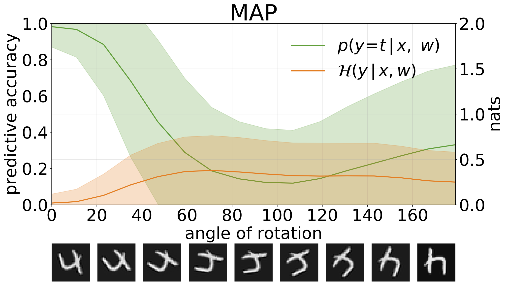

### Uncertainty Decomposition
We can measure uncertainty in our models' predictions through predictive entropy.
We can decompose this term in order to distinguish between 2 types of uncertainty.
Uncertainty caused by noise in the data, or **Aleatoric uncertainty**, can be
 quantified as the expected entropy of model predictions. Model uncertainty
 or **Epistemic uncertainty** can be measured as the difference between total entropy
 and aleatoric entropy.

## Results

### Homoscedastic Regression

Toy homoscedastic regression task. Data is generated by a GP with a RBF
 kernel (l = 1, σn = 0.3). We use a single-output FC network with one hidden layer of
  200 ReLU units to predict the regression mean μ(x). A fixed log σ is learnt separately.
<p float="center">
  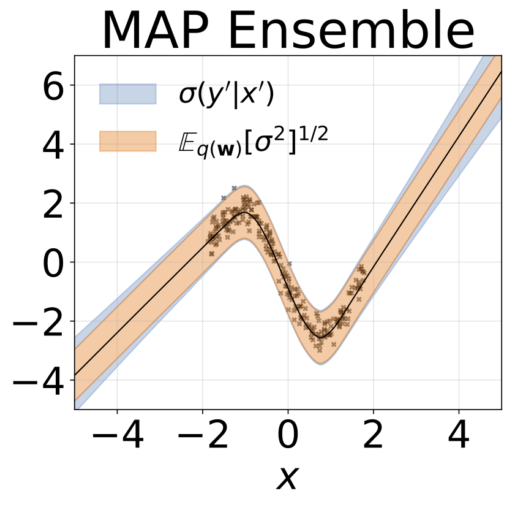
  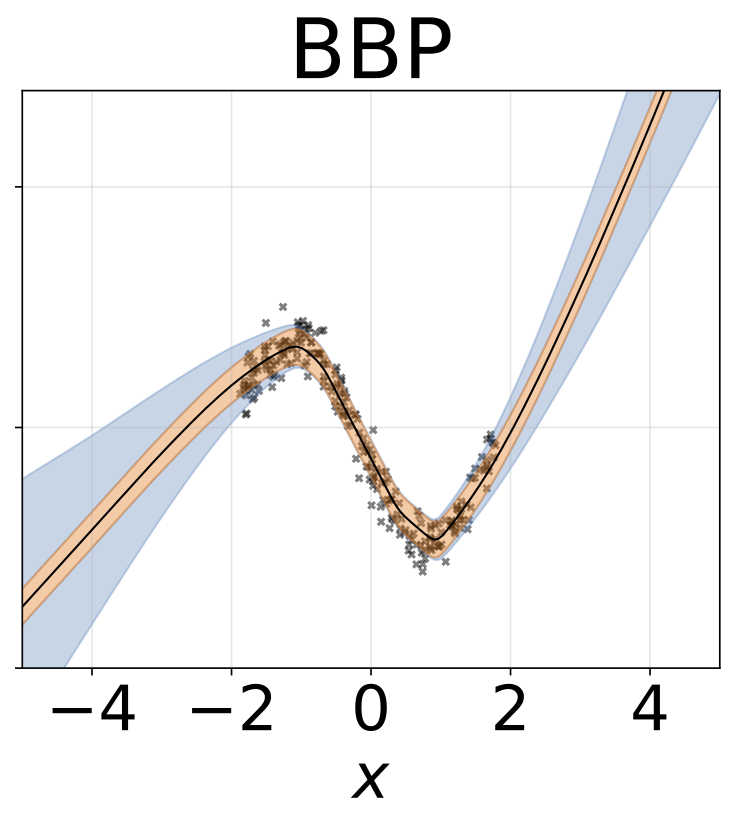 
  
  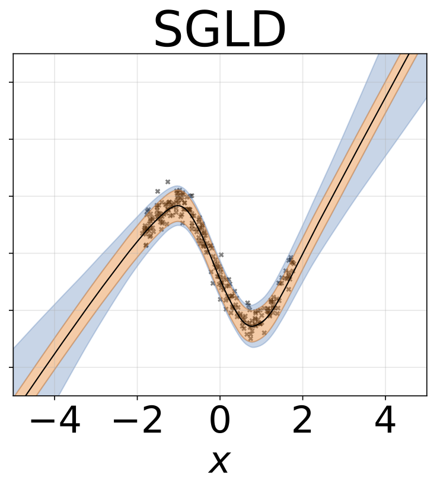 
  
</p>

### Heteroscedastic Regression
Same scenario as previous section but log σ(x) is predicted from the input.
<p float="center">
  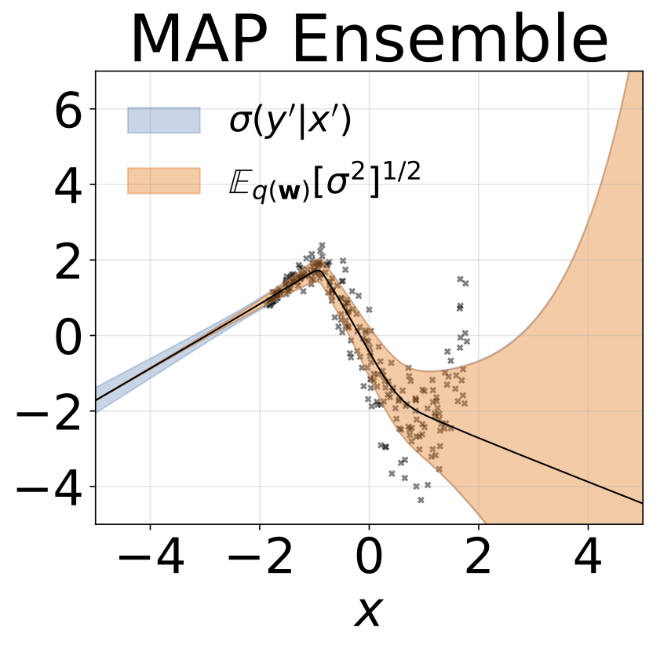
  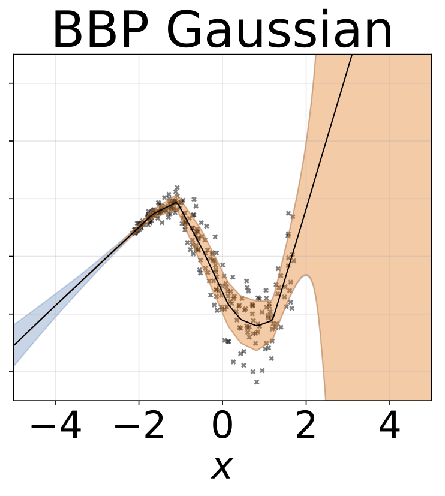 
  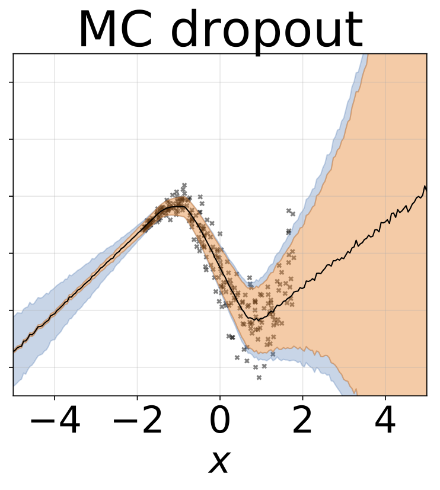
   
  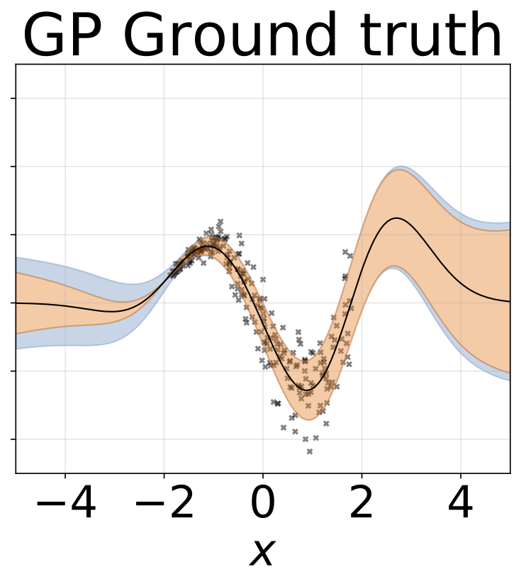
</p>

Toy heteroscedastic regression task. Data is generated by a GP with a RBF
 kernel (l = 1 σn = 0.3 · |x + 2|). We use a two-head network with 200 ReLU units to predict the regression mean μ(x) and log-standard deviation log σ(x).
 
### Regression on UCI datasets

We performed heteroscedastic regression on the six UCI datasets
 ([housing](https://archive.ics.uci.edu/ml/machine-learning-databases/housing/),
  [concrete](http://archive.ics.uci.edu/ml/datasets/concrete+compressive+strength),
   [energy efficiency](https://archive.ics.uci.edu/ml/datasets/energy+efficiency),
    [power plant](https://archive.ics.uci.edu/ml/datasets/combined+cycle+power+plant),
     [red wine](https://archive.ics.uci.edu/ml/datasets/wine+quality) and [yacht](http://archive.ics.uci.edu/ml/datasets/yacht+hydrodynamics) datasets),
      using 10-foild cross validation. All these experiments are contained in the heteroscedastic notebooks. 
      Note that results depend heavily on hyperparameter selection. Plots below show log-likelihoods and RMSEs 
on the train (semi-transparent colour) and test (solid colour). Circles and error bars correspond 
to the 10-fold cross validation mean and standard deviations respectively.

<p float="center">
  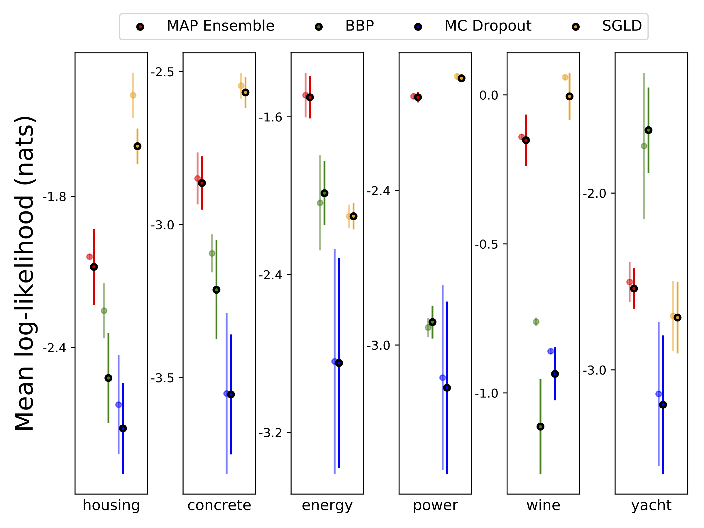
  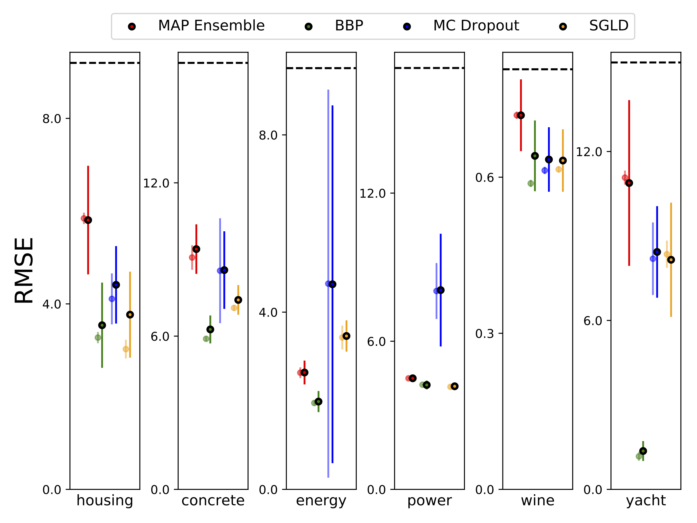
</p>

### MNIST Classification

W is marginalised with 100 samples of the weights for all models except
MAP, where only one set of weights is used.

|      MNIST Test	|   MAP   	| MAP  Ensemble 	| BBP  Gaussian 	| BBP  GMM 	| BBP  Laplace 	| BBP Local Reparam 	| MC Dropout 	|   SGLD  	|  pSGLD  	|
|:--------------:	|:-------:	|:-------------------:	|:--------------:	|:---------:	|:-------------:	|:-------------------:	|:----------:	|:-------:	|:-------:	|
| Log Like	| -572.9 	|       -496.54       	|    -1100.29    	|  -1008.28 	|    -892.85    	|       -1086.43      	|  -435.458  	| -828.29 	| -661.25 	|
|    Error \%    	|   1.58  	|         1.53        	|      2.60      	|    2.38   	|      2.28     	|         2.61        	|    1.37    	|   1.76  	|   1.76  	|

MNIST test results for methods under consideration. Estensive hyperparameter
tunning has not been performed. We approximate
 the posterior predictive distribution with 100 MC samples. We use a FC
  network with two 1200 unit ReLU layers. If unspecified, the prior is
   Gaussian with std=0.1. P-SGLD uses RMSprop preconditioning.

 [The original paper](https://arxiv.org/abs/1505.05424) for Bayes By Backprop
 reports around 1% error on MNIST. We find that this result is attainable
 only if approximate posterior variances are initialised to be very small (BBP Gauss 2).
 In this scenario, the distributions over weights resemble deltas, giving 
 good predictive performance but bad uncertainty estimates. 
 However, when initialising the variances to match the prior (BBP Gauss 1), we obtain the above results.
 The training curves for both of these hyperparameter configuration schemes
 are shown below:

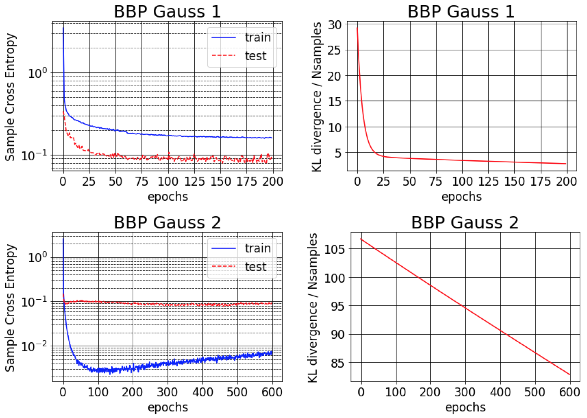


### MNIST Uncertainty

Total, aleatoric and epistemic uncertainties obtained when
creating OOD samples by augmenting the MNIST test set with rotations:


Total and epistemic uncertainties obtained by testing our models, - which 
have been trained on MNIST -, on the KMNIST dataset:

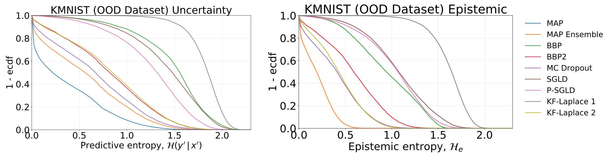

### Adversarial robustness


Total, aleatoric and epistemic uncertainties obtained when
feeding our models with adversarial samples (fgsm).


### Weight Distributions

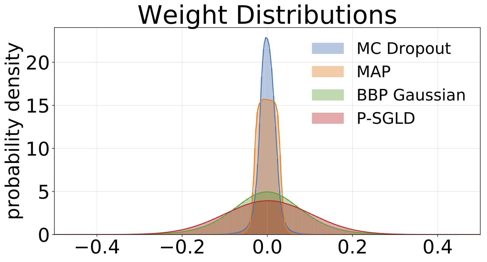

Histograms of weights sampled from each model trained on MNIST. We draw 10 samples of w for each model.

### Weight Pruning

\#TODO
