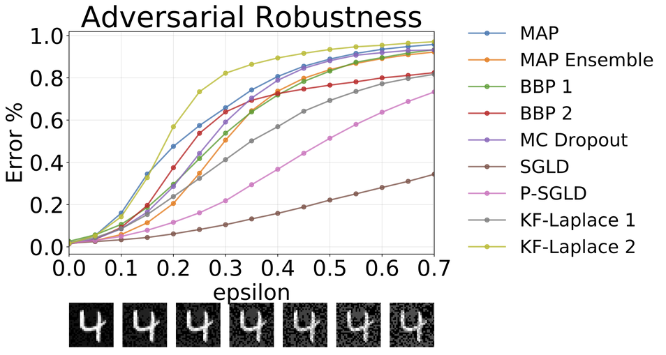
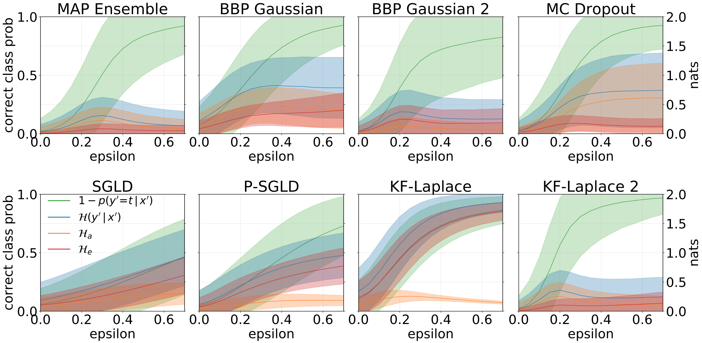
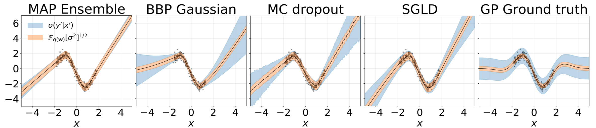
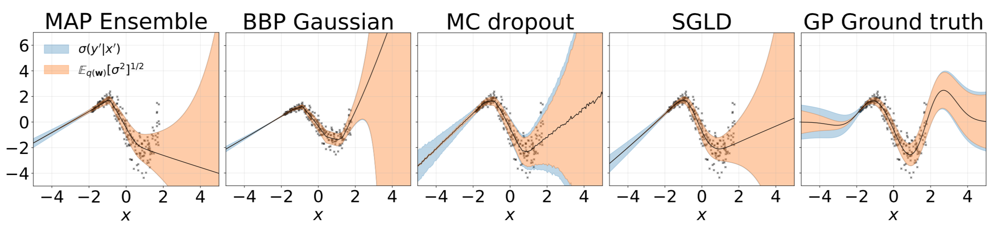

# Bayesian Neural Networks

Pytorch implementations for the following approximate inference methods:

* [Bayes by Backprop](#bayes-by-backprop)
* [Bayes by Backprop + Local Reparametrisation Trick](#local-reparametrisation-trick)
* [MC dropout](#mc-dropout)
* [Stochastic Gradient Langevin Dynamics](#stochastic-gradient-langevin-dynamics)
* [Preconditioned SGLD](#pSGLD)
* Kronecker Factorised Laplace Approximation (Coming Soon)

We also provide code for:
* [Bootstrap MAP Ensemble](#bootstrap-map-ensemble)

### Prerequisites
* PyTorch
* Numpy
* Matplotlib

The project is written in python 2.7. If CUDA is available, it will be
used automatically. The models can also run on CPU as they are not excessively big.

## Usage

### Structure

*train_(ModelName)_(Dataset).py*: Trains (ModelName) on (Dataset). Training
metrics and model weights will be saved to the specified directories.

*src/*: General utilities and model definitions.

*Notebooks/*: An asortment of notebooks which allow for model training, evaluation and
running of digit rotation uncertainty experiments. They also allow for weight
distribution plotting and weight pruning.  They allow for loading of pre-trained models
for experimentation.

### Bayes by Backprop (BBP)
(https://arxiv.org/abs/1505.05424)

Train a model on MNIST:
```bash
python train_BayesByBackprop_MNIST.py [--model [MODEL]] [--prior_sig [PRIOR_SIG]] [--epochs [EPOCHS]] [--lr [LR]] [--n_samples [N_SAMPLES]] [--models_dir [MODELS_DIR]] [--results_dir [RESULTS_DIR]]
```
For an explanation of the script's arguments:
```bash
python train_BayesByBackprop_MNIST.py -h
```

Best results are obtained with a Laplace prior.

#### Local Reparametrisation Trick
(https://arxiv.org/abs/1506.02557)

Bayes By Backprop inference where the mean and variance of activations
 are calculated in closed form. Activations are sampled instead of
 weights. This makes the variance of the Monte Carlo ELBO estimator scale
 as 1/M, where M is the minibatch size. Sampling weights scales (M-1)/M.
 The KL divergence between gaussians can also be computed in closed form,
 further reducing variance. Computation of each epoch is faster and so is convergence.

Train a model on MNIST:
```bash
python train_BayesByBackprop_MNIST.py --model Local_Reparam [--prior_sig [PRIOR_SIG]] [--epochs [EPOCHS]] [--lr [LR]] [--n_samples [N_SAMPLES]] [--models_dir [MODELS_DIR]] [--results_dir [RESULTS_DIR]]
```

### MC Dropout
(https://arxiv.org/abs/1506.02142)

A fixed dropout rate of 0.5 is set.

Train a model on MNIST:
```bash
python train_MCDropout_MNIST.py [--weight_decay [WEIGHT_DECAY]] [--epochs [EPOCHS]] [--lr [LR]] [--models_dir [MODELS_DIR]] [--results_dir [RESULTS_DIR]]
```
For an explanation of the script's arguments:
```bash
python train_MCDropout_MNIST.py -h
```


### Stochastic Gradient Langevin Dynamics (SGLD)
(https://www.ics.uci.edu/~welling/publications/papers/stoclangevin_v6.pdf)

In order to converge to the true posterior over w, the learning rate
should be annealed according to the [Robbins-Monro](https://en.wikipedia.org/wiki/Stochastic_approximation)
 conditions. In practise, we use a fixed learning rate.

Train a model on MNIST:
```bash
python train_SGLD_MNIST.py [--use_preconditioning [USE_PRECONDITIONING]] [--prior_sig [PRIOR_SIG]] [--epochs [EPOCHS]] [--lr [LR]] [--models_dir [MODELS_DIR]] [--results_dir [RESULTS_DIR]]
```
For an explanation of the script's arguments:
```bash
python train_SGLD_MNIST.py -h
```

#### pSGLD
(https://arxiv.org/abs/1512.07666)

SGLD with RMSprop preconditioning. A higher learning rate should be used
than for vanilla SGLD.

Train a model on MNIST:
```bash
python train_SGLD_MNIST.py --use_preconditioning True [--prior_sig [PRIOR_SIG]] [--epochs [EPOCHS]] [--lr [LR]] [--models_dir [MODELS_DIR]] [--results_dir [RESULTS_DIR]]
```

### Bootstrap MAP Ensemble

Multiple networks are trained on subsamples of the dataset.

Train an ensemble on MNIST:
```bash
python train_Bootrap_Ensemble_MNIST.py [--weight_decay [WEIGHT_DECAY]] [--subsample [SUBSAMPLE]] [--n_nets [N_NETS]] [--epochs [EPOCHS]] [--lr [LR]] [--models_dir [MODELS_DIR]] [--results_dir [RESULTS_DIR]]
```
For an explanation of the script's arguments:
```bash
python train_Bootrap_Ensemble_MNIST.py -h
```

## Approximate Inference in Neural Networks

Map inference provides a point estimate of parameter values. When provided with
out of distribution inputs, such as rotated digits, these models then to
make wrong predictions with high confidence.


### Uncertainty Decomposition
We can measure uncertainty in our models' predictions through predictive entropy.
We can decompose this term in order to distinguish between 2 types of uncertainty.
Uncertainty caused by noise in the data, or **Aleatoric uncertainty**, can be
 quantified as the expected entropy of model predictions. Model uncertainty
 or **Epistemic uncertainty** can be measured as the difference between total entropy
 and aleatoric entropy.

## Results

### MNIST Classification

W is marginalised with 100 samples of the weights for all models except
MAP, where only one set of weights is used.

|      MNIST Test	|   MAP   	| MAP  Ensemble 	| BBP  Gaussian 	| BBP  GMM 	| BBP  Laplace 	| BBP Local Reparam 	| MC Dropout 	|   SGLD  	|  pSGLD  	|
|:--------------:	|:-------:	|:-------------------:	|:--------------:	|:---------:	|:-------------:	|:-------------------:	|:----------:	|:-------:	|:-------:	|
| Log Like	| -572.9 	|       -496.54       	|    -1100.29    	|  -1008.28 	|    -892.85    	|       -1086.43      	|  -435.458  	| -828.29 	| -661.25 	|
|    Error \%    	|   1.58  	|         1.53        	|      2.60      	|    2.38   	|      2.28     	|         2.61        	|    1.37    	|   1.76  	|   1.76  	|

MNIST test results for methods under consideration. Estensive hyperparameter
tunning has not been performed. We approximate
 the posterior predictive distribution with 100 MC samples. We use a FC
  network with two 1200 unit ReLU layers. If unspecified, the prior is
   Gaussian with std=0.1. P-SGLD uses RMSprop preconditioning.

 [The original paper](https://arxiv.org/abs/1505.05424) for Bayes By Backprop
 reports around 1% error on MNIST. We find that this result is attainable
 only if approximate posterior variances are initialised to be very small (BBP Gauss 2).
 In this scenario, the distributions over weights resemble deltas, giving 
 good predictive performance but bad uncertainty estimates. 
 However, when initialising the variances to match the prior (BBP Gauss 1), we obtain the above results.
 The training curves for both of these hyperparameter configuration schemes
 are shown below:


### MNIST Uncertainty

Total, aleatoric and epistemic uncertainties obtained when
creating OOD samples by augmenting the MNIST test set with rotations:


Total and epistemic uncertainties obtained by testing our models, - which 
have been trained on MNIST -, on the KMNIST dataset:


### Adversarial robustness



Total, aleatoric and epistemic uncertainties obtained when
feeding our models with adversarial samples (fgsm).




### Homoscedastic Regression



Toy homoscedastic regression task. Data is generated by a GP with a RBF
 kernel (l = 1, σn = 0.3). We use a single-output FC network with one hidden layer of 200 ReLU units to predict the regression mean μ(x). A fixed log σ is learnt separately.

### Heteroscedastic Regression



Toy heteroscedastic regression task. Data is generated by a GP with a RBF
 kernel (l = 1 σn = 0.3 · |x + 2|). We use a two-head network with 200 ReLU units to predict the regression mean μ(x) and log-standard deviation log σ(x).

### Weight Distributions


Histograms of weights sampled from each model trained on MNIST. We draw 10 samples of w for each model.

### Weight Pruning

\#TODO